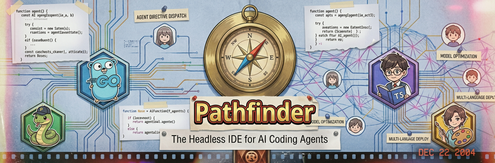

<div align="center">
  
  <h2 align="center">🧭 Pathfinder</h2>

  [](https://github.com/irahardianto/pathfinder/actions/workflows/ci.yml)
  [](https://app.deepsource.com/gh/irahardianto/pathfinder/)
  [](https://github.com/irahardianto/qurio/actions/workflows/github-code-scanning/codeql)
  [](https://dependabot.com/)
  [](https://github.com/irahardianto/pathfinder/actions/workflows/slsa-provenance.yml)

  <p align="center">
    The Headless IDE — an MCP server that gives AI coding agents<br />
    AST-aware code intelligence, semantic navigation, and LSP-backed discovery.
    <br />
    <br />
    <a href="#getting-started">Getting Started</a>
    ·
    <a href="#agent-directives">Agent Directives</a>
    ·
    <a href="#tools">View Tools</a>
    ·
    <a href="https://github.com/irahardianto/pathfinder/issues">Request Feature</a>
    <br />
    <br />
  </p>
</div>

<!-- ABOUT THE PROJECT -->
## About Pathfinder

**Pathfinder** is an [MCP (Model Context Protocol)](https://modelcontextprotocol.io/) server written in Rust that gives AI coding agents the same code intelligence a human developer gets from an IDE — but without a GUI.

Instead of treating source code as flat text, Pathfinder understands your code structurally through **Tree-sitter AST parsing** and semantically through **Language Server Protocol (LSP)** integration. This means AI agents can navigate, search, and explore code at the *symbol* level — functions, classes, methods — rather than fragile line-by-line string matching.

### Why Pathfinder?

Traditional AI coding workflows suffer from:

- **Blind navigation** — agents read entire files to find one symbol, wasting context.
- **No semantic understanding** — flat text search returns hits in comments, strings, and dead code equally.
- **Fragile path construction** — agents guess file structures instead of discovering them.

Pathfinder solves these problems by providing:

- 🌳 **AST-Aware Navigation** — jump to symbols using semantic paths (e.g., `src/auth.ts::AuthService.login`).
- 🔍 **Semantic Search** — filter search results by AST context (code-only, comments-only, or all) powered by ripgrep + Tree-sitter.
- 📡 **LSP-Powered Discovery** — go-to-definition, call hierarchy (incoming/outgoing), and real-time indexing status.
- 🗺️ **Structural Mapping** — a token-budgeted repository skeleton that surfaces every symbol and its semantic path.
- 🛡️ **Sandbox Security** — a 3-tier file access model prevents path traversal attacks and unauthorized file access.
- 📊 **Built-in Observability** — per-engine telemetry (`ripgrep_ms`, `tree_sitter_parse_ms`, `lsp_ms`) and optional `--lsp-trace` for raw JSON-RPC debugging.

### Key Features

- 🛠️ **7 MCP Tools** — covering code exploration, semantic search, file reading, symbol inspection, navigation, impact tracing, and LSP health.
- 🌐 **8 Languages** — native Tree-sitter support for Go, Java, TypeScript, TSX, JavaScript, Python, Rust, and Vue SFCs.
- 🏗️ **5 Rust Crates** — modular workspace architecture for clean separation of concerns.
- ⚡ **Zero Configuration** — auto-detects languages and LSP servers in your workspace.

<!-- GETTING STARTED -->
## Getting Started

### Prerequisites

- **Rust toolchain** (1.75+ recommended) — [Install via rustup](https://rustup.rs/)
- **An MCP-compatible AI client** — such as [Antigravity](https://antigravity.dev/), Claude Desktop, Cursor, or any tool supporting MCP stdio transport.
- **(Optional) Language servers** — for LSP navigation support (e.g., `gopls` for Go, `typescript-language-server` for TS/JS, `rust-analyzer` for Rust, `pyright` for Python).

### Installation

Choose one of the following methods:

**Homebrew (macOS & Linux):**

```sh
brew tap irahardianto/pathfinder-mcp
brew install pathfinder-mcp
```

**cargo install from crates.io:**

```sh
cargo install pathfinder-mcp
```

**Build from source:**

```sh
git clone https://github.com/irahardianto/pathfinder.git
cd pathfinder
cargo build --release
# The binary will be at target/release/pathfinder-mcp
```

**Verify the installation:**

```sh
pathfinder-mcp --help
```

### Configuration

#### MCP Client Configuration

Add Pathfinder to your MCP client's server configuration. The exact format depends on your client.

**Example (JSON config for most MCP clients):**

```json
{
  "mcpServers": {
    "pathfinder": {
      "command": "pathfinder-mcp",
      "args": ["/path/to/your/workspace"]
    }
  }
}
```

**With LSP trace enabled (for debugging):**

```json
{
  "mcpServers": {
    "pathfinder": {
      "command": "pathfinder-mcp",
      "args": ["--lsp-trace", "/path/to/your/workspace"]
    }
  }
}
```

#### CLI Usage

```
pathfinder-mcp [OPTIONS] <WORKSPACE_PATH>

Arguments:
  <WORKSPACE_PATH>  Path to the workspace root directory

Options:
      --lsp-trace  Enable raw LSP JSON-RPC tracing to stderr (DEBUG level)
  -h, --help       Print help
  -V, --version    Print version
```

Pathfinder communicates over **stdio** using the MCP protocol. Logs are emitted as structured JSON to **stderr** (since stdout is reserved for MCP transport).

<!-- AGENT DIRECTIVES -->
## Agent Directives

Pathfinder ships with a set of **agent directives** — pre-written rules and skills that teach your AI agent how to use Pathfinder tools correctly, reliably, and efficiently. Without these, the agent falls back to generic file-reading behaviour and misses most of Pathfinder's value.

> **Why this matters:** An AI agent that doesn't know about semantic paths or the difference between `read` for a source file vs a config file will make avoidable mistakes — calling the wrong tool, constructing malformed paths, or wasting context reading entire files for single symbols. The directives encode all of this knowledge directly into the agent's system context.

### What's Included

The directives live in [`docs/agent_directives/`](docs/agent_directives/) and mirror the rules and skills used during Pathfinder's own development:

```
docs/agent_directives/
├── AGENTS.md                   # Always-on routing rule: which Pathfinder tool to use for each action
└── skills/
    └── pathfinder/
        └── SKILL.md            # On-demand skill: concrete navigation workflows and error recovery
```

**`AGENTS.md`** — an always-on rule injected into every agent turn. It tells the agent:
- To prefer Pathfinder's semantic tools over built-in text tools whenever possible
- How to form correct semantic paths (e.g., `src/auth.ts::AuthService.login`)
- Which tool to reach for each action (reading, searching, navigating)
- When to fall back gracefully if Pathfinder is unavailable

**`skills/pathfinder/SKILL.md`** — a detailed on-demand skill the agent activates when it needs deeper guidance. It covers:
- Step-by-step workflows for exploring, auditing, and debugging codebases
- Efficient search with `filter_mode`, `exclude_glob`, `known_files`, `group_by_file`, and `is_regex`
- Error recovery patterns for `SYMBOL_NOT_FOUND`, LSP degradation, and timeout scenarios

### Setup by Client

#### Antigravity

Copy the directives into your project's `.agents/` directory. Antigravity auto-discovers all rules and skills placed there:

```sh
# From your project root (not the Pathfinder repo)
mkdir -p .agents/skills
cp /path/to/pathfinder/docs/agent_directives/AGENTS.md .agents/
cp -r /path/to/pathfinder/docs/agent_directives/skills/* .agents/skills/
```

The routing rule runs on every agent turn automatically (`trigger: always_on`). The workflow skill is activated on demand when the agent needs detailed guidance.

#### Claude Desktop / Cursor / Other MCP Clients

For clients that support system prompt injection or custom instructions, paste the content of `AGENTS.md` into your **system prompt** or **custom instructions** field. Then reference `skills/pathfinder/SKILL.md` as additional context or attach it as a project document.

For clients that support agent rule files (e.g., `.cursorrules`, `.clinerules`), you can drop the `AGENTS.md` content directly into those files.

#### General Approach

For any MCP-compatible client, the minimum effective setup is to inject the **AGENTS.md routing rule** into the agent's persistent context. This single file prevents the most common mistakes. The workflow skill is optional but significantly improves the quality of complex multi-step tasks.

<!-- TOOLS -->
## Tools

Pathfinder exposes 7 tools. Every tool operates within the workspace sandbox and returns structured JSON responses.

### 🗺️ Exploration & Search

| Tool | Description |
|---|---|
| `explore` | Get the structural skeleton of the project — directory tree, file listing, or full AST symbol hierarchy. Three detail levels: `structure` (dirs + package files), `files` (dirs + all filenames), `symbols` (default — full AST hierarchy). Token-budgeted with configurable `depth` and `max_tokens`. Supports `changed_since`, `include_extensions`, and `exclude_extensions` for focused exploration. |
| `search` | Search for text patterns, regex, or resolve symbol names across the codebase. Three modes: `text` (default — literal search), `regex` (pattern search), `symbol` (resolve bare name to semantic paths). AST-aware filtering (code-only by default). Token-efficiency parameters: `known_files`, `exclude_glob`, `path_glob`. |

### 📖 Reading & Inspection

| Tool | Description |
|---|---|
| `read` | Read file contents — single file or batch (max 10). Auto-detects source vs config files. Source files (.rs, .ts, .go, .py, .vue, .js, .java) get AST-parsed content with detail levels (`source_only`, `compact`, `symbols`, `full`). Config files get raw content. Supports `start_line`/`end_line` for line ranges. |
| `inspect` | Extract a symbol's source code by semantic path, optionally with its dependency graph. Default: source only (fast, Tree-sitter). With `include_dependencies=true`: also fetches callee signatures (LSP-powered). |

### 🧭 Navigation & Tracing

| Tool | Description |
|---|---|
| `locate` | Jump to a symbol's definition, or resolve a file+line to its semantic path. Two auto-detected modes: provide `semantic_path` for definition lookup, or `file`+`line` for semantic path resolution. LSP-powered with ripgrep fallback. |
| `trace` | Trace a symbol's relationships — callers/callees, all references, or full overview. Three scopes: `callers` (default — call hierarchy), `references` (all usages including imports, type annotations), `overview` (combined source + callers + callees + references). Essential for understanding blast radius before refactoring. |

### 🔧 Utility

| Tool | Description |
|---|---|
| `health` | Check per-language LSP readiness — including `navigation_ready`, `indexing_status`, `supports_call_hierarchy`, and `degraded_tools`. Use to diagnose why navigation tools returned degraded results. Supports `action="restart"` to force-restart a stuck LSP. |

<!-- ARCHITECTURE -->
## Architecture

Pathfinder is structured as a Rust workspace with 5 crates, each with a clear responsibility:

```
pathfinder/
├── crates/
│   ├── pathfinder/              # MCP server, CLI, tool routing
│   │   └── src/
│   │       ├── main.rs          # CLI entry point (clap)
│   │       └── server/
│   │           ├── server.rs    # MCP tool router
│   │           ├── types.rs     # Parameter & response types
│   │           ├── helpers.rs   # Shared utilities
│   │           └── tools/       # One module per tool category
│   │               ├── consolidated.rs  # 7-tool consolidated handlers
│   │               ├── search.rs
│   │               ├── navigation/      # LSP-backed navigation
│   │               ├── file_ops.rs
│   │               ├── repo_map.rs
│   │               ├── source_file.rs
│   │               ├── symbols.rs
│   │               ├── find_symbol.rs
│   │               ├── read_files.rs
│   │               └── semantic_path.rs
│   │
│   ├── pathfinder-common/       # Shared types, errors, config, sandbox
│   ├── pathfinder-treesitter/   # The Surgeon — AST parsing & symbol extraction
│   ├── pathfinder-search/       # The Scout — ripgrep-powered code search
│   └── pathfinder-lsp/          # The Lawyer — LSP client & lifecycle management
│
├── docs/
│   ├── requirements/            # PRD and specifications
│   ├── research_logs/           # Design decisions and research
│   └── audits/                  # Code audit findings
│
├── Cargo.toml                   # Workspace manifest
├── LICENSE                      # MIT License
└── README.md
```

### The Three Engines

Pathfinder internally delegates work to three specialized engines, each abstracted behind a trait for testability:

| Engine | Crate | Trait | Responsibility |
|---|---|---|---|
| **The Surgeon** | `pathfinder-treesitter` | `Surgeon` | AST parsing, symbol extraction, semantic path resolution, repo map generation |
| **The Scout** | `pathfinder-search` | `Scout` | Ripgrep-powered full-text search with Tree-sitter enrichment for AST-aware filtering |
| **The Lawyer** | `pathfinder-lsp` | `Lawyer` | LSP process lifecycle, go-to-definition, call hierarchy, references, and go-to-implementation navigation |

Each engine can be mocked independently for unit testing, and the server gracefully degrades when an engine is unavailable (e.g., falls back to Tree-sitter heuristics when no LSP is running).

### Core Concepts

#### Semantic Paths

Pathfinder identifies code symbols using semantic paths — a human-readable notation that mirrors how developers think about code structure:

```
src/auth.ts::AuthService.login          # Method
src/utils/math.go::CalculateDiscount    # Function
lib/models.py::User                     # Class
```

Format: `<relative_file_path>::<Symbol>[.<Method>]`

#### Version Hashes

Every file read returns a `version_hash` (SHA-256 digest of the file content). This is a content fingerprint that agents can use to detect when a file has changed between reads — useful for coordinating multi-step workflows and detecting concurrent modifications.

### Supported Languages

#### Tree-sitter Support (Built-in, Zero Configuration)

Tree-sitter grammars are compiled directly into the Pathfinder binary — no external tools needed. All symbol extraction, semantic path resolution, and AST-aware filtering work out of the box.

| Language | Extension(s) | Notes |
|---|---|---|
| Go | `.go` | Function, interface, struct, and type alias extraction |
| Java | `.java` | Class, interface, enum, record, and method extraction with inner class hierarchy |
| TypeScript | `.ts` | Class, function, arrow function, interface, and type extraction |
| TSX | `.tsx` | All TypeScript symbols **plus** JSX element extraction as child symbols |
| JavaScript | `.js`, `.jsx` | Functions, classes, and JSX elements in `.jsx` files |
| Python | `.py` | Function, class, and method extraction |
| Rust | `.rs` | Functions, structs, enums, traits; `impl` block methods merged under their parent type |
| Vue SFC | `.vue` | **Multi-zone**: `<script>` parsed as TypeScript (AST-aware), `<template>` and `<style>` accessible for text search |

#### LSP Support (Optional, Auto-detected)

Pathfinder automatically detects which language servers are available in your workspace by scanning for marker files (`Cargo.toml`, `go.mod`, `tsconfig.json`, etc.). LSP processes start **lazily** on first use and are shut down after an idle timeout.

To maximise navigation coverage, install the language server(s) for your project:

| Language | LSP Server | Install Command | Auto-detect Marker |
|---|---|---|---|
| **Rust** | `rust-analyzer` | `rustup component add rust-analyzer` | `Cargo.toml` at workspace root |
| **Go** | `gopls` | `go install golang.org/x/tools/gopls@latest` | `go.mod` (scans up to depth 2) |
| **TypeScript / JavaScript / JSX / TSX / Vue** | `typescript-language-server` | `npm install -g typescript-language-server typescript` | `tsconfig.json` or `package.json` (depth 2) |
| **Python** | `pyright` | `npm install -g pyright` | `pyproject.toml`, `setup.py`, or `requirements.txt` (depth 2) |
| **Java** | `jdtls` | [Eclipse JDT Language Server](https://github.com/eclipse-jdtls/eclipse.jdt.ls) | `pom.xml` or `build.gradle` (depth 2) |

> **Vue note:** Pathfinder handles Vue SFC parsing internally with Tree-sitter. The `typescript-language-server` validates the `<script>` block — no separate `volar` or `vue-language-server` installation is required.

> **Concurrent LSP handling:** When Pathfinder detects a concurrent LSP instance (e.g., your IDE is already running `gopls`), it automatically isolates build caches to avoid lock contention. Isolated caches are stored under `.pathfinder/` in your project root, which is automatically added to `.gitignore`. Use the `health` tool to check per-language readiness, including `navigation_ready` (LSP navigation works), `indexing_status` (background indexing state), and `degraded_tools` (which tools lose LSP support for a given language).

<!-- OBSERVABILITY -->
## Observability

Pathfinder emits structured JSON logs to stderr with per-engine timing breakdowns:

```json
{
  "timestamp": "2026-03-31T05:30:00Z",
  "level": "INFO",
  "message": "search completed",
  "ripgrep_ms": 12,
  "tree_sitter_parse_ms": 45,
  "total_matches": 23,
  "duration_ms": 62
}
```

Enable `--lsp-trace` for full JSON-RPC request/response logging at DEBUG level — useful for diagnosing LSP communication issues.

<!-- SECURITY -->
## Security

Pathfinder implements a **3-tier sandbox model**:

| Tier | Type | What It Blocks |
|---|---|---|
| **Tier 1** | Hardcoded Deny *(cannot be overridden)* | `.git/objects/`, `.git/HEAD`, `*.pem`, `*.key`, `*.pfx` — security-critical paths |
| **Tier 2** | Default Deny *(overridable via config)* | `.env`, `node_modules/`, `vendor/`, `dist/`, `build/`, `__pycache__/` |
| **Tier 3** | User-Defined | Patterns in `.pathfinderignore` (gitignore syntax) |

- All file paths are canonicalized and validated before any I/O operation.
- Path traversal attacks (e.g., `../../etc/passwd`) are rejected at Tier 1.
- The `WorkspaceRoot` type enforces that only valid, existing directories are accepted as workspace roots.
- Tier 2 patterns can be selectively overridden via `SandboxConfig.allow_override`; additional deny patterns can be added via `SandboxConfig.additional_deny`.

<!-- ROADMAP -->
## Roadmap

- [x] Core MCP server with stdio transport
- [x] Tree-sitter-powered AST parsing (Go, TypeScript, TSX, JSX, JavaScript, Python, Rust, Vue SFC)
- [x] Vue Single-File Component multi-zone parsing (`<script>`, `<template>`, `<style>`)
- [x] JSX/TSX element extraction as addressable child symbols
- [x] Ripgrep search with AST-aware filtering (`code_only`, `comments_only`, `all`)
- [x] Search intelligence: `known_files`, `group_by_file`, `exclude_glob` (E4)
- [x] LSP integration for go-to-definition and call hierarchy navigation
- [x] LSP lifecycle management (auto-start, crash recovery, idle termination)
- [x] Proactive capability reporting via `explore` (`capabilities.lsp.per_language`)
- [x] Two-phase LSP readiness model (navigation vs indexing) with `health` tool
- [x] Concurrent LSP cache isolation (Go, TypeScript, Python, Rust)
- [x] Probe-based readiness fallback with TTL-cached results
- [x] 3-tier sandbox security model
- [x] Per-engine observability and telemetry
- [x] `explore` temporal filtering (`changed_since`) and extension filters (E6)
- [x] `read` with source_only/compact/symbols/full detail modes and line range filtering (E2)
- [x] Pre-built binaries via Homebrew tap and cargo install
- [x] Java language support (Tree-sitter + jdtls LSP integration)
- [x] `trace(scope="references")` — LSP `textDocument/references`
- [x] `trace(scope="callers")` — call hierarchy (renamed from `analyze_impact`)
- [x] `search(mode="symbol")` — resolve bare symbol names to semantic paths
- [x] `read(paths=[...])` — batch multi-file reading with per-file error resilience
- [x] `trace(scope="overview")` — composite source + callers + callees + references
- [x] `locate(file, line)` — convert file:line locations to semantic paths
- [x] 14→7 tool consolidation for cleaner agent interface
- [ ] Additional language support (C/C++, C#, Kotlin, etc.)
- [ ] Custom LSP server command overrides via configuration file

<!-- CONTRIBUTING -->
## Contributing

Contributions are welcome! Pathfinder follows strict engineering practices:

1. Fork the repository
2. Create your feature branch (`git checkout -b feature/amazing-feature`)
3. Commit your changes (`git commit -m 'feat: add amazing feature'`)
4. Push to the branch (`git push origin feature/amazing-feature`)
5. Open a Pull Request

### Development

```sh
# Run tests
cargo test --workspace

# Run with clippy (pedantic + deny unwrap)
cargo clippy --workspace --all-targets

# Format
cargo fmt --all --check

# Dependency audit
cargo deny check
```

> The workspace enforces `clippy::pedantic`, `deny(unwrap_used)`, `warn(expect_used)`, and `deny(unsafe_code)`.

<!-- LICENSE -->
## License

Distributed under the MIT License. See the [LICENSE](LICENSE) file for details.

---

<p align="center">
  Built with 🦀 in Rust
</p>
