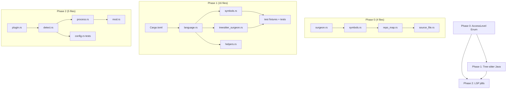

# File Change Manifest

Every file that needs modification, grouped by phase, ordered by dependency (modify dependencies first).

## Phase 0: AccessLevel Enum Refactoring

### Crate: `pathfinder-treesitter`

| Order | File | Action | Description |
|-------|------|--------|-------------|
| 1 | `src/surgeon.rs` | MODIFY | Add `AccessLevel` enum; change `is_public: bool` → `access_level: AccessLevel` |
| 2 | `src/symbols.rs` | MODIFY | Replace `has_visibility_modifier()` with `detect_access_level()`; add per-language detection functions; update all 12 production `is_public` sites; update 13 test sites |
| 3 | `src/repo_map.rs` | MODIFY | Delete `is_symbol_public()`; simplify `filter_by_visibility()` (remove `lang_is_go` param); update `generate_skeleton_text()`; update 12 test sites |

### Crate: `pathfinder`

| Order | File | Action | Description |
|-------|------|--------|-------------|
| 4 | `src/server/tools/source_file.rs` | MODIFY | Update 1 test site (`is_public: true` → `access_level: AccessLevel::Public`) |

**Total files**: 4 | **Total production changes**: 14 sites | **Total test changes**: 26 sites

---

## Phase 1: Tree-sitter Java Integration

### Crate: `pathfinder-treesitter`

| Order | File | Action | Description |
|-------|------|--------|-------------|
| 1 | `Cargo.toml` | MODIFY | Add `tree-sitter-java = "0.23"` dependency |
| 2 | `src/language.rs` | MODIFY | Add `Java` variant to `SupportedLanguage`; impl `detect()`, `as_str()`, `grammar()`, `node_types()` |
| 3 | `src/symbols.rs` | MODIFY | Add `Java` arm to `detect_access_level()` dispatch; add `detect_java_access_level()`; update `refine_class_kind()` with Java match arms |
| 4 | `src/treesitter_surgeon.rs` | MODIFY | Add `text_block` to `is_string_node()` |
| 5 | `tests/fixtures/BasicClass.java` | NEW | Test fixture |
| 6 | `tests/fixtures/InterfaceWithDefaults.java` | NEW | Test fixture |
| 7 | `tests/fixtures/RecordExample.java` | NEW | Test fixture |
| 8 | `tests/fixtures/SealedHierarchy.java` | NEW | Test fixture |
| 9 | `tests/fixtures/EnumWithMethods.java` | NEW | Test fixture |
| 10 | `tests/fixtures/AnnotationType.java` | NEW | Test fixture |
| 11 | `tests/fixtures/InnerClasses.java` | NEW | Test fixture |
| 12 | `tests/fixtures/GenericClass.java` | NEW | Test fixture |
| 13 | `tests/fixtures/LambdaExpressions.java` | NEW | Test fixture |
| 14 | `tests/fixtures/ModuleInfo.java` | NEW | Test fixture (edge case) |
| 15 | `tests/test_java.rs` | NEW | Integration tests for all Java fixtures |

### Crate: `pathfinder`

| Order | File | Action | Description |
|-------|------|--------|-------------|
| 16 | `src/server/helpers.rs` | MODIFY | Add `"java" => "java"` to `language_from_path()` |
| 17 | `src/server/tools/source_file.rs` | MODIFY | Add `"java" => Some("java")` to `touch_language` extension mapping (~line 196). Without this, jdtls idle timer won't extend during active `.java` file reads, causing premature shutdown. |

**Total files**: 17 (5 modified, 12 new)

---

## Phase 2: LSP Integration (jdtls)

### Crate: `pathfinder-lsp`

| Order | File | Action | Description |
|-------|------|--------|-------------|
| 1 | `src/plugin.rs` | MODIFY | Add `JavaPlugin` struct; register in `all_plugins()`; update tests |
| 2 | `src/client/detect.rs` | MODIFY | Add `"java"` to `language_id_for_extension()`; add `"java"` to `install_hint()`; add Java detection block in `detect_languages()`; add `("java", "pom.xml")` to `validate_marker_file()`; replace `python_path` with `init_options` in `LanguageLsp`; add `detect_java_init_options()` |
| 3 | `src/client/process.rs` | MODIFY | Replace `python_path` param with `init_options` in `spawn_and_initialize()` (line ~135) and `build_initialize_request()` (line ~343, changes 3-way conditional semantics); add jdtls data directory creation (NOT gated on `isolate_target_dir`); add `ensure_pathfinder_in_gitignore()` call for Java |
| 4 | `src/client/mod.rs` | MODIFY | Update `start_process()` call site (line ~788): `descriptor.python_path` → `descriptor.init_options`; update test helper (line ~2466) |

### Crate: `pathfinder-common`

| Order | File | Action | Description |
|-------|------|--------|-------------|
| 5 | `src/config.rs` | MODIFY | Ensure `[lsp.java]` config section works (already generic — just add tests) |

**Total files**: 5 (all modified)

---

## Grand Total Across All Phases

| Phase | Modified | New | Total |
|-------|----------|-----|-------|
| Phase 0 | 4 | 0 | 4 |
| Phase 1 | 5 | 12 | 17 |
| Phase 2 | 5 | 0 | 5 |
| **Total** | **14** | **12** | **26** |

---

## Dependency Graph

