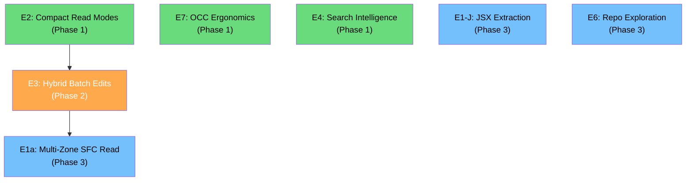

# Pathfinder v5 Requirements — Agent Experience Hardening

**Version:** 5.0  
**Status:** Approved  
**Date:** 2026-04-01  
**Origin:** First-hand agent experience report from a Vue 3 + TypeScript debugging session, refined through multi-agent review  

---

## 1. Executive Summary

This document defines the requirements to elevate Pathfinder from a "net positive for pure backend codebases" to "indispensable for any codebase" — including frontend-heavy projects with Vue SFCs, JSX/TSX, CSS, and templating languages.

### Current Agent Experience Ratings (from real-world usage)

| Dimension             | Current | Target | Gap Analysis                                                          |
| --------------------- | ------- | ------ | --------------------------------------------------------------------- |
| Search                | ⭐⭐⭐⭐    | ⭐⭐⭐⭐⭐  | Good but missing context deduplication for already-known files         |
| Read (source)         | ⭐⭐⭐     | ⭐⭐⭐⭐⭐  | Output bloat; forced temp-file redirect; no compact mode              |
| Read (config)         | ⭐⭐⭐⭐    | ⭐⭐⭐⭐⭐  | Clean, sufficient for v5 — structural awareness deferred to v6        |
| Edit (script)         | ⭐⭐⭐     | ⭐⭐⭐⭐⭐  | Single-symbol OK; multi-symbol awkward due to OCC chaining            |
| Edit (template/CSS)   | ⭐       | ⭐⭐⭐⭐⭐  | Cannot target non-AST content; forced fallback to built-in tools      |
| Impact analysis       | ⭐⭐⭐⭐⭐   | ⭐⭐⭐⭐⭐  | Already excellent — maintain                                         |
| Repo exploration      | ⭐⭐⭐⭐    | ⭐⭐⭐⭐⭐  | Excellent but missing `--changed-since` filter for focused exploration |
| OCC safety            | ⭐⭐⭐⭐    | ⭐⭐⭐⭐⭐  | Genuine advantage; needs text-targeting in batch to eliminate chaining |

### Design Principles for v5

1. **Zero fallback to built-in tools.** Every editing scenario that an agent encounters in a supported language MUST be completable with Pathfinder tools alone.
2. **One tool call, not three.** Where agents currently chain 3+ sequential calls due to OCC or targeting limitations, provide a single-call alternative.
3. **Compact by default, verbose on demand.** Default output should optimize for token efficiency. Rich metadata available via explicit flags.
4. **Agent-native, not IDE-native.** Features should be designed for LLM consumption patterns (token budgets, parallel tool calls, stateless reasoning).

---

## 2. Epics Overview

### Shipping in v5

| Epic | Title                                         | Phase    | Estimated Complexity |
| ---- | --------------------------------------------- | -------- | -------------------- |
| E2   | Compact Read Modes                            | Phase 1  | Medium               |
| E7   | OCC Ergonomics & Agent Experience Polish       | Phase 1  | Medium               |
| E4   | Search Intelligence Improvements              | Phase 1  | Medium               |
| E3   | Hybrid Text+Semantic Batch Edits              | Phase 2  | Medium               |
| E1a  | Multi-Zone SFC Read Awareness                 | Phase 3  | Medium               |
| E1-J | JSX/TSX Symbol Extraction                     | Phase 3  | Low                  |
| E6   | Repo Exploration Enhancements                 | Phase 3  | Low                  |

### Icebox (v6+, tracked as GitHub Issues)

| Epic | Title                                         | Reason Deferred                                             |
| ---- | --------------------------------------------- | ----------------------------------------------------------- |
| E1b  | Semantic Template & Style Editing             | DOM elements are not logic symbols; E3.1 covers the use case |
| E3.2 | Multi-File Search & Replace Tool              | Too dangerous; regex + multi-file writes risk codebase corruption |
| E5   | Config File Structural Awareness              | Over-engineered; agents handle config files well with text tools |
| E8   | Cross-File Atomic Operations                  | Two-phase LSP commits across files add race conditions and timeouts |

---

## 3. Phase 1 — Token Efficiency & Error Experience

### Epic E2 — Compact Read Modes

#### Problem Statement

When an agent calls `read_source_file` on a 348-line Vue component, the output is so large (file content + full AST symbol tree with start/end lines for every node) that it gets saved to a temp file. The agent then has to call `view_file` on the temp file — turning a 1-step operation into 2 steps.

#### E2.1 — `detail_level` Parameter for `read_source_file`

**Description:** Replace the verbose default output with a `detail_level` enum that controls output density.

**Parameter:**

| Parameter      | Type   | Default     | Description                                       |
| -------------- | ------ | ----------- | ------------------------------------------------- |
| `detail_level` | string | `"compact"` | One of `"compact"`, `"symbols"`, `"full"`         |

**Output by Detail Level:**

| Level       | Content          | Symbol Info                                        | Estimated Size                |
| ----------- | ---------------- | -------------------------------------------------- | ----------------------------- |
| `compact`   | Full source      | Flat list of top-level names + kinds               | Content + ~200 chars          |
| `symbols`   | None             | Full nested AST tree with line ranges              | ~500-2000 chars               |
| `full`      | Full source      | Full nested AST tree with line ranges (v4.6 behavior) | Content + full AST            |

**Acceptance Criteria:**
- Default is `compact` (breaking change — documented in §12)
- `compact` output fits inline for files up to ~500 lines without temp-file redirect
- `full` produces identical output to current v4.6 behavior
- `symbols` returns `{ version_hash, language, symbols }` without file content
- `version_hash` is always present regardless of detail level

#### E2.2 — Line-Range Read for `read_source_file`

**Description:** Add optional `start_line` and `end_line` parameters.

**Parameters:**

| Parameter    | Type | Default | Description                              |
| ------------ | ---- | ------- | ---------------------------------------- |
| `start_line` | int  | `1`     | First line to return (1-indexed)         |
| `end_line`   | int  | `null`  | Last line to return (null = end of file) |

**Use Case:** When the agent knows the region of interest (e.g., from a search result) and wants to read just that region with its AST context.

**Acceptance Criteria:**
- Content is truncated to the specified line range
- Symbols are filtered to only those overlapping the line range
- `version_hash` still covers the full file (for OCC)

---

### Epic E7 — OCC Ergonomics & Agent Experience Polish

#### Problem Statement

OCC hash chaining creates friction for multi-symbol edits. Error messages are terse and don't guide agents toward recovery.

#### E7.1 — Version Hash Elision Guarantee

**Description:** Formally guarantee that `version_hash` from any read/search result is immediately usable as `base_version` for edit tools — no intermediate `read_source_file` call needed.

**Current Flow (3 calls):**
1. `search_codebase("pattern")` → gets `version_hash: "abc"`
2. `read_source_file("file.ts")` → gets `version_hash: "abc"` (redundant read)
3. `replace_batch(file, base_version="abc", edits=[...])` → applies edits

**Desired Flow (2 calls):**
1. `search_codebase("pattern")` → gets `version_hash: "abc"`
2. `replace_batch(file, base_version="abc", edits=[...])` → applies edits directly

**Acceptance Criteria:**
- `version_hash` from `search_codebase`, `get_repo_map`, and `read_source_file` is always usable as `base_version` for edit tools
- Document this guarantee explicitly in tool descriptions

#### E7.2 — Lightweight Diff on Version Mismatch

**Description:** When an edit fails with `VERSION_MISMATCH`, include the current `version_hash` and a lightweight diff summary so the agent can decide whether to retry.

**Enhanced Error Response:**
```json
{
  "error": "VERSION_MISMATCH",
  "current_version_hash": "sha256:def456...",
  "lines_changed": "+3/-1",
  "hint": "The file was modified. Use the new hash to retry your edit if the changes do not overlap with your target."
}
```

**Implementation Notes:**
- Compute line-delta via simple line-count comparison — `O(N)` string scan, not a full diff algorithm
- Do NOT compute `changed_symbols` — this requires parsing both versions and is too expensive
- `lines_changed` format: `+N/-M` (lines added / lines removed)

**Acceptance Criteria:**
- `hint` is **always** present in `VERSION_MISMATCH` errors
- `lines_changed` is **best-effort**: populated when both old and new content are available (e.g., TOCTOU late-check in `flush_edit_with_toctou`), and `null` otherwise
- When populated, computation is O(N) in file size (line count comparison only)

> **Design Decision — Stateless OCC (2026-04-02)**
>
> The initial acceptance criteria stated `lines_changed` would be "always present." This was revised after implementation analysis revealed a fundamental constraint:
>
> Pathfinder's OCC model is **stateless** — the server stores no per-file history. When an agent calls an edit tool, it supplies only a `base_version` SHA-256 hash. The server computes the *current* file hash and compares them. To compute a `+N/-M` delta, the server would need the **prior file content** — which it never stored.
>
> **Why git diff cannot solve this:**
> - OCC hashes track the *filesystem* state, not the *git commit* state. A file is considered "changed" the instant it is saved — no commit required.
> - The most common cause of `VERSION_MISMATCH` is an unsaved edit by another agent or tool, which has no git record at all.
> - `git diff` compares against a commit. The OCC model tracks ephemeral, per-session snapshots that are never committed.
> - Git is not guaranteed to be present in all workspaces Pathfinder serves.
>
> **Decision:** Keep Pathfinder stateless. Populate `lines_changed` only at `flush_edit_with_toctou`, where both the pre-write and the just-read-from-disk content are already in scope. All other `VersionMismatch` sites emit `lines_changed: null`. The `hint` field — which IS always present and guides agents to re-read with the new hash — is the primary recovery signal.

#### E7.3 — Actionable Error Hints

**Description:** All error responses include a `hint` field with an actionable suggestion referencing specific Pathfinder tools.

**Standard Hints:**

| Error                  | Hint                                                                                      |
| ---------------------- | ----------------------------------------------------------------------------------------- |
| `SYMBOL_NOT_FOUND`     | `"Did you mean: stopServer, startServer? Use read_source_file to see available symbols."` |
| `INVALID_TARGET`       | `"replace_body requires a block-bodied construct. For constants, use replace_full."`       |
| `VERSION_MISMATCH`     | `"The file was modified. Use the new hash to retry your edit if the changes do not overlap with your target."` |
| `ACCESS_DENIED`        | `"File is outside workspace sandbox. Check .pathfinderignore rules."`                      |
| `UNSUPPORTED_LANGUAGE` | `"No tree-sitter grammar for .xyz files. Use read_file and write_file instead."`           |

**Acceptance Criteria:**
- Every error variant includes a `hint` field
- `SYMBOL_NOT_FOUND` includes fuzzy-match suggestions (already implemented via `strsim`)
- Hints reference specific Pathfinder tools as alternatives

---

### Epic E4 — Search Intelligence Improvements

#### Problem Statement

`search_codebase` is effective but wastes tokens by re-dumping context for files the agent already knows about.

#### E4.1 — Deduplicated Results for Known Files

**Description:** Add a `known_files` parameter to suppress verbose context for files the agent has already read.

**Parameter:**

| Parameter     | Type     | Default | Description                                        |
| ------------- | -------- | ------- | -------------------------------------------------- |
| `known_files` | string[] | `[]`    | List of file paths the agent already has in context |

**Behavior:** For files matching a path in `known_files`:
- Return only `{ file, line, column, enclosing_semantic_path }` (no `content`, no `context_before`/`context_after`)
- Include `known: true` flag in the match

**Rationale:** The agent has already read these files and has the content in context. Re-dumping context lines wastes tokens without adding information. Using paths (not hashes) because agents naturally know _which_ files they've read, not what the hashes were.

**Acceptance Criteria:**
- Matches in known files return minimal metadata
- Matches in unknown files return full context (unchanged behavior)
- Path comparison is normalized (relative to workspace root)

#### E4.2 — Result Grouping by File

**Description:** Add a `group_by_file` parameter to cluster results.

**Parameter:**

| Parameter       | Type | Default | Description                       |
| --------------- | ---- | ------- | --------------------------------- |
| `group_by_file` | bool | `false` | Group matches by file in response |

**Grouped Output:**
```json
{
  "file_groups": [
    {
      "file": "src/auth.ts",
      "version_hash": "sha256:...",
      "matches": [
        { "line": 42, "column": 8, "content": "...", "enclosing_semantic_path": "..." },
        { "line": 87, "column": 12, "content": "...", "enclosing_semantic_path": "..." }
      ]
    }
  ]
}
```

**Acceptance Criteria:**
- Grouped output deduplicates `file` and `version_hash` per group
- Non-grouped output remains unchanged (backward compatible)

#### E4.3 — Exclude Patterns

**Description:** Add an `exclude_glob` parameter to filter out files from search results.

**Parameter:**

| Parameter      | Type   | Default | Description                       |
| -------------- | ------ | ------- | --------------------------------- |
| `exclude_glob` | string | `""`    | Glob pattern for files to exclude |

**Use Case:** `exclude_glob: "**/*.test.*"` to search production code only.

**Acceptance Criteria:**
- Exclude patterns are applied before search (not as post-filter)
- Can be combined with `path_glob` include patterns

---

## 4. Phase 2 — The Universal Escape Hatch

### Epic E3 — Hybrid Text+Semantic Batch Edits

#### Problem Statement

`replace_batch` currently requires every edit to specify a `semantic_path`, meaning it can only target AST symbols. For Vue SFCs and other template-heavy files, agents often need to make edits across `<script>`, `<template>`, and `<style>` zones in a single atomic operation. Currently this requires mixed tool usage with incompatible OCC models.

#### E3.1 — Text-Range Edits in `replace_batch`

**Description:** Extend `BatchEdit` to support text-based targeting alongside semantic-path targeting. This is the primary mechanism for editing template and style content — not semantic template paths (see Icebox §11 for rationale).

**Extended `BatchEdit` Schema:**

```json
// Option A: Semantic targeting (existing behavior)
{
  "semantic_path": "file.vue::script::check",
  "edit_type": "replace_body",
  "new_code": "..."
}
```
```json
// Option B: Text targeting (new — flat schema as implemented)
{
  "old_text": "<button class=\"check-btn\">Check</button>",
  "context_line": 42,
  "replacement_text": "<button class=\"check-btn\" :disabled=\"isCorrect\">Check</button>"
}
```

**Rules:**
- Each edit in the batch specifies EITHER `semantic_path` + `edit_type` + `new_code` OR `old_text` + `context_line` + `replacement_text`
- `context_line` is **required** (not optional) when `old_text` is set — prevents ambiguous matching across the file
- Text matching searches for `old_text` within a ±10 line window around `context_line`
- If `old_text` is not found within the window, the edit fails with `TEXT_NOT_FOUND` + hint
- All edits in the batch share a single `base_version` and are applied atomically
- Edits are sorted by byte offset (highest first) and applied bottom-up so text edits don't corrupt byte offsets of subsequent AST edits

**Whitespace Handling:**
- Default: exact string matching (whitespace-sensitive)
- Optional `normalize_whitespace: bool` (default `false`) — when `true`, collapses `\s+` to single space before matching. Useful for HTML/template contexts where indentation may be inconsistent. Do NOT use for Python, YAML, or any whitespace-significant language.

**Acceptance Criteria:**
- Mixed semantic + text edits work in a single `replace_batch` call
- OCC is checked once for the entire file at the beginning
- If any edit fails to resolve (semantic path not found, text not found), the entire batch is rejected — no partial application
- TOCTOU late-check still applies before disk write
- `context_line` is required; omission returns a validation error with hint

---

## 5. Phase 3 — Structural Intelligence

### Epic E1a — Multi-Zone SFC Read Awareness

#### Problem Statement

Pathfinder currently parses Vue SFCs by extracting the `<script>` block via regex and treating it as TypeScript. The `<template>` and `<style>` blocks are completely opaque — agents cannot search for template patterns, see component usage in the repo map, or get `enclosing_semantic_path` for matches inside `<template>`.

With E3.1 (text targeting) available for editing, E1a focuses purely on **reading and understanding** Vue SFCs across all three zones — enabling smarter search, richer repo maps, and structural awareness without attempting semantic editing of DOM elements.

#### E1a.1 — Vue SFC Multi-Zone Parsing via `set_included_ranges`

**Description:** Extend `pathfinder-treesitter` to parse Vue SFCs into three semantic zones, each with its own tree-sitter grammar, using tree-sitter's native `Parser::set_included_ranges` API.

**Implementation Approach:**

1. **Zone Scanner:** Write a byte-range scanner (extending existing `extract_vue_script()` in `language.rs`) to locate the byte-range boundaries of `<script>`, `<template>`, and `<style>` top-level blocks in the SFC.

2. **Multi-Grammar Parsing via `set_included_ranges`:**
   - Initialize `tree-sitter-typescript` parser → `parser.set_included_ranges(&[script_byte_range])`
   - Initialize `tree-sitter-html` parser → `parser.set_included_ranges(&[template_byte_range])`
   - Initialize `tree-sitter-css` parser → `parser.set_included_ranges(&[style_byte_range])`

3. **Why `set_included_ranges`:** Tree-sitter natively understands it is parsing a subset of a larger file. AST nodes automatically possess their exact global byte offsets and global line numbers relative to the original SFC. **Zero custom offset math is required.**

**Zone Model:**

| Zone       | Grammar                           | Symbol Extraction                                     |
| ---------- | --------------------------------- | ----------------------------------------------------- |
| `script`   | TypeScript (current behavior)     | Functions, classes, constants, interfaces              |
| `template` | HTML (`tree-sitter-html`)         | Component usages, element tags with key attributes     |
| `style`    | CSS (`tree-sitter-css`)           | Selectors (class, id, element), `@media`/`@keyframes` |

**Semantic Path Extension for Multi-Zone:**

```
file.vue::script::functionName           # Script symbols (unchanged)
file.vue::template::ComponentName        # Component usage in template
file.vue::template::div[nth]             # Nth occurrence of a tag (read-only addressing)
file.vue::style::.className              # CSS class rule
file.vue::style::#elementId              # CSS id rule
file.vue::style::@media[nth]             # Nth @media rule
```

> **Note:** These semantic paths are for **read operations only** (symbol listing, search enrichment, `read_symbol_scope`). For editing template/style content, agents use E3.1 text targeting in `replace_batch`.

**Acceptance Criteria:**
- `extract_symbols_from_tree` returns symbols from all three zones for `.vue` files
- `read_symbol_scope` can target `template` and `style` symbols for reading
- `search_codebase` returns `enclosing_semantic_path` for matches in any zone
- `get_repo_map` includes template component usages and CSS selectors in the file skeleton
- Each zone uses `set_included_ranges` — no custom byte-offset arithmetic
- Backward compatibility: queries without zone prefix still resolve to script block
- Fallback: if `tree-sitter-html` or `tree-sitter-css` is not available, degrade gracefully to script-only (current behavior) with `degraded: true`

#### E1a.2 — AstCache Multi-Zone Support

**Description:** Update `AstCache` to store multi-zone parse results for Vue SFCs.

**Implementation:**
- Cache key changes from `(path, language)` to `(path, language, zone)` — or cache a `MultiZoneResult` struct containing all three trees
- Cache invalidation: any file modification invalidates all zone caches for that file
- Memory: three small ASTs instead of one — minimal overhead since template/style trees are typically small

**Acceptance Criteria:**
- Repeated reads of the same Vue SFC zone hit the cache
- File modification invalidates all zones simultaneously
- Non-Vue files are unaffected (single-zone caching unchanged)

#### New Tree-Sitter Grammar Dependencies

| Grammar            | Crate                  | Version | Purpose                  |
| ------------------ | ---------------------- | ------- | ------------------------ |
| `tree-sitter-html` | `tree-sitter-html`     | 0.23.x  | Vue `<template>` parsing |
| `tree-sitter-css`  | `tree-sitter-css`      | 0.25.x  | Vue `<style>` parsing    |

Both are actively maintained and compatible with `tree-sitter 0.24`. No custom grammar development needed.

---

### Epic E1-J — JSX/TSX Symbol Extraction

#### Problem Statement

JSX elements within `.tsx`/`.jsx` files are already parsed by `tree-sitter-tsx` but are not extracted as symbols. Agents cannot see component usage or element structure in the repo map or get `enclosing_semantic_path` for matches inside JSX return statements.

#### E1-J.1 — JSX Element Extraction

**Description:** Extend symbol extraction for TSX/JSX files to include JSX elements within function return statements.

**Implementation:** This requires NO new grammars — `tree-sitter-tsx` already parses JSX nodes. The work is purely in `extract_symbols_from_tree` to recognize and emit `jsx_element` and `jsx_self_closing_element` nodes as child symbols of their enclosing function.

**Semantic Path for JSX:**
```
Component.tsx::ComponentName::return::Button[nth]
Component.tsx::ComponentName::return::div[nth]
```

**Acceptance Criteria:**
- JSX elements within function return statements are extractable as child symbols
- `enclosing_semantic_path` resolves correctly for matches inside JSX
- `get_repo_map` shows JSX component usage in the file skeleton
- Read-only — editing JSX elements uses E3.1 text targeting

---

### Epic E6 — Repo Exploration Enhancements

#### E6.1 — Changed-Since Filter for `get_repo_map`

**Description:** Add a `changed_since` parameter to show only recently modified files.

**Parameter:**

| Parameter       | Type   | Default | Description                                              |
| --------------- | ------ | ------- | -------------------------------------------------------- |
| `changed_since` | string | `""`    | Git ref or duration (e.g., `HEAD~5`, `3h`, `2024-01-01`) |

**Pipeline:**
1. Run `git diff --name-only <changed_since>` to get the file list
2. Filter `get_repo_map` output to include only those files
3. All other parameters (`max_tokens`, `depth`, `visibility`) still apply

**Acceptance Criteria:**
- Supports git refs (`HEAD~5`, `main`, commit hashes)
- Supports relative durations (`3h`, `1d`, `7d`)
- If git is not available, returns full map with `degraded: true`

#### E6.2 — File-Type Filtering for `get_repo_map`

**Description:** Add `include_extensions` and `exclude_extensions` parameters.

**Parameters:**

| Parameter            | Type     | Default | Description                             |
| -------------------- | -------- | ------- | --------------------------------------- |
| `include_extensions` | string[] | `[]`    | Only include files with these extensions |
| `exclude_extensions` | string[] | `[]`    | Exclude files with these extensions      |

**Acceptance Criteria:**
- Extension filters apply before AST parsing (performance optimization)
- `include_extensions` and `exclude_extensions` are mutually exclusive

---

## 6. Verification Plan

### Automated Testing Strategy

Each epic requires comprehensive test coverage before merge:

#### Unit Tests (per crate)

| Epic  | Crate                   | Test Focus                                                               |
| ----- | ----------------------- | ------------------------------------------------------------------------ |
| E2    | `pathfinder` (server)   | `read_source_file` compact/symbols/full mode output shape                |
| E7    | `pathfinder` (server)   | Enhanced error responses with hints and line-delta summaries             |
| E4    | `pathfinder` (server)   | `search_codebase` with `known_files` and `group_by_file`                |
| E3    | `pathfinder` (server)   | `replace_batch` with mixed semantic + text edits, `context_line` window |
| E1a   | `pathfinder-treesitter` | Vue multi-zone parsing via `set_included_ranges`, symbol extraction      |
| E1-J  | `pathfinder-treesitter` | JSX element extraction from TSX files                                    |

#### Integration Tests

| Test                          | What It Validates                                                                   |
| ----------------------------- | ----------------------------------------------------------------------------------- |
| Vue SFC multi-zone read       | Read Vue file → symbols from all 3 zones → `enclosing_semantic_path` in template    |
| Mixed batch edit              | `replace_batch` with semantic script edit + text template edit → atomic application  |
| Search deduplication          | `search_codebase` with `known_files` → minimal output for known, full for unknown   |
| Vue SFC search enrichment     | Search in `<template>` zone → correct `enclosing_semantic_path` returned            |

#### Commands to Run

```bash
# Unit tests
cargo test --workspace

# Integration tests
cargo test --workspace -- --test-threads=1 --ignored

# Linting
cargo clippy --workspace --all-targets -- -D warnings

# Formatting
cargo fmt --all -- --check
```

### Manual Verification

After implementation, request an agent to run the same Vue 3 debugging session against the new Pathfinder and produce an updated experience report. Target: all dimensions at ⭐⭐⭐⭐⭐.

---

## 7. Implementation Priority and Dependencies



**Phase 1 (parallel):** E2, E7, E4 — all independent, no inter-dependencies  
**Phase 2:** E3 — depends on E2 (agents use compact reads to discover what to edit)  
**Phase 3 (parallel):** E1a, E1-J, E6 — E1a depends on E3 being shipped (agents use text targeting for edits); E1-J and E6 are independent

---

## 8. Breaking Changes

| Change                                | Impact                        | Migration                                 |
| ------------------------------------- | ----------------------------- | ----------------------------------------- |
| `read_source_file` default to compact | Agents get smaller output     | Set `detail_level: "full"` to restore verbose |
| Vue semantic paths gain zone prefix   | `script::` prefix on existing paths | Query without prefix still resolves to script block for backward compatibility |

---

## 9. Non-Goals for v5

1. **SCSS/LESS/Sass support** — CSS-only in v5; preprocessor languages are a v6 concern
2. **Svelte/Astro SFC support** — Vue and React only in v5; other SFC frameworks are post-v5
3. **Multi-workspace** — Still one process per workspace (deliberate design decision)
4. **Background indexing** — Still on-demand parsing (core differentiator vs Sourcegraph)
5. **AI-powered auto-fix** — Pathfinder is infrastructure, not an agent; no auto-correction
6. **Semantic editing of HTML/CSS** — Template editing uses text targeting (E3.1), not AST paths (see Icebox)
7. **Config file structural editing** — Agents handle YAML/TOML/JSON well with text tools (see Icebox)

---

## 10. Expected Star Ratings After v5

| Dimension             | Current | After Phase 1 | After Phase 2 | After Phase 3 (v5 GA) |
| --------------------- | ------- | ------------- | ------------- | ---------------------- |
| Search                | ⭐⭐⭐⭐    | ⭐⭐⭐⭐⭐          | ⭐⭐⭐⭐⭐          | ⭐⭐⭐⭐⭐                   |
| Read (source)         | ⭐⭐⭐     | ⭐⭐⭐⭐⭐          | ⭐⭐⭐⭐⭐          | ⭐⭐⭐⭐⭐                   |
| Edit (script)         | ⭐⭐⭐     | ⭐⭐⭐⭐           | ⭐⭐⭐⭐⭐          | ⭐⭐⭐⭐⭐                   |
| Edit (template/CSS)   | ⭐       | ⭐             | ⭐⭐⭐⭐⭐          | ⭐⭐⭐⭐⭐                   |
| Impact analysis       | ⭐⭐⭐⭐⭐   | ⭐⭐⭐⭐⭐          | ⭐⭐⭐⭐⭐          | ⭐⭐⭐⭐⭐                   |
| Repo exploration      | ⭐⭐⭐⭐    | ⭐⭐⭐⭐           | ⭐⭐⭐⭐           | ⭐⭐⭐⭐⭐                   |
| OCC safety            | ⭐⭐⭐⭐    | ⭐⭐⭐⭐⭐          | ⭐⭐⭐⭐⭐          | ⭐⭐⭐⭐⭐                   |

---

## 11. Icebox — Deferred to v6+ (GitHub Issue Descriptions)

> The following items are intentionally deferred from v5. Each section is written as a self-contained GitHub issue body with full context so that any contributor (human or AI agent) can pick it up without prior conversation history.

---

### Issue: E1b — Semantic Template & Style Editing via AST Paths

**Title:** `[v6] Enable AST-targeted editing of Vue <template> and <style> elements via semantic paths`

#### Context

Pathfinder v5 introduced multi-zone SFC awareness (E1a) for **reading** — agents can see template component usages, CSS selectors, and get `enclosing_semantic_path` for search matches across all three Vue SFC zones. For **editing**, v5 relies on E3.1's text targeting in `replace_batch`, which lets agents specify `old_text` + `context_line` to edit template and style content.

E1b would extend the existing edit operations (`replace_body`, `replace_full`, `insert_before`, `insert_after`, `delete_symbol`) to work on template and style symbols identified by semantic path — the same way they currently work on script symbols.

#### Why It Was Deferred

1. **DOM elements are not logic symbols.** A `<div class="foo">` is fundamentally different from a function — it has no unique identity beyond its position in the DOM tree. Addressing it as `template::div[4]` is fragile: inserting a new `<div>` above it changes all subsequent indices.

2. **The disambiguation problem.** Given `<div class="foo"><div class="bar">`, how does an agent target the inner div? Options include:
   - Index-based: `div[2]` — fragile, changes with DOM edits
   - Attribute-based: `div.bar` — conflicts with CSS selector syntax
   - XPath-like: `div.foo > div.bar` — complex, non-standard for Pathfinder's path model

3. **E3.1 covers the use case.** In practice, agents editing HTML want to say "replace this exact HTML fragment near line 42." Text targeting does this naturally without requiring the agent to learn a template-specific path syntax.

#### What Would Need to Happen to Implement This

1. **Design a stable addressing scheme** for template elements that survives DOM mutations. Consider content-hash-based addressing or parent-chain paths.
2. **Extend the Surgeon's edit pipeline** to support `replace_body` semantics for HTML elements (inner content = between open/close tags).
3. **Handle self-closing elements** — ``, `<br />`, `<input />` have no body to `replace_body`.
4. **CSS rule editing** — `replace_body` on a CSS selector replaces the declaration block (inside `{}`). This is more natural than HTML editing since CSS rules have clear structure.
5. **Indentation preservation** — template edits must preserve the nesting-level indentation of the surrounding HTML.
6. **OCC hash** must remain file-level (not per-zone) to avoid consistency bugs.
7. **`replace_batch`** must support mixed `script` + `template` + `style` semantic edits in a single atomic call.

#### Prerequisites
- E1a (Multi-Zone SFC Read Awareness) must be stable and battle-tested
- E3.1 (Text Targeting) usage data showing cases where text targeting is insufficient

#### Estimated Complexity
High — primarily due to the addressing scheme design, not the parsing infrastructure (which E1a already provides).

---

### Issue: E3.2 — Multi-File Search & Replace Tool

**Title:** `[v6] Add search_and_replace tool for mechanical multi-file text substitutions`

#### Context

When performing mechanical refactors (renaming a CSS class across all files, updating an import path after a module rename, replacing a deprecated API call), agents currently must:
1. Call `search_codebase` to find all occurrences
2. Call `replace_batch` on each affected file individually
3. Handle OCC per file

A dedicated `search_and_replace` tool would combine these into a single atomic operation.

#### Proposed API

| Parameter     | Type   | Default    | Description                                     |
| ------------- | ------ | ---------- | ----------------------------------------------- |
| `query`       | string | *required* | Exact text or regex pattern to find              |
| `is_regex`    | bool   | `false`    | Treat query as regex                             |
| `replacement` | string | *required* | Replacement text (supports regex capture groups) |
| `path_glob`   | string | `**/*`     | Limit scope                                      |
| `dry_run`     | bool   | `true`     | Preview changes without writing (default safe)   |
| `max_files`   | int    | `20`       | Safety limit on number of files modified          |

#### Why It Was Deferred

1. **Regex + multi-file writes is a loaded gun.** An agent miscrafting a regex could corrupt dozens of files simultaneously. `max_files: 20` limits the blast radius but 20 corrupted files is still catastrophic.

2. **Dry-run-first means 2 tool calls anyway.** The safe usage pattern is `dry_run: true` → review → `dry_run: false`, which doesn't save calls compared to search + per-file batch edits.

3. **E3.1 covers most use cases.** For a handful of files, agents can search, then `replace_batch` each file with text targeting. This is slower but much safer.

4. **OCC across all files is fragile.** The agent must hold valid hashes for every target file before the operation. In practice, files change during the agent's work session — one stale hash rejects the entire operation.

#### What Would Need to Happen to Implement This

1. **`dry_run: true` must be the default** — force explicit `confirm: true` to execute writes.
2. **Add a regex validation step** that rejects obviously dangerous patterns (`.`, `.*`, empty string, patterns that match >100 locations).
3. **Implement per-file backup/undo** — snapshot all affected files before writing, allow rollback.
4. **Rate-limit scope** — consider requiring `path_glob` when `is_regex: true` to prevent unbounded regex searches.
5. **Pipeline:** `search_codebase` internally → read each affected file → verify OCC → apply all replacements atomically per file → return summary.

#### Prerequisites
- E3.1 (Hybrid Batch Edits) in production and proven stable
- Real-world evidence that per-file batch editing is insufficient for common refactoring scenarios

#### Estimated Complexity
Medium (implementation) + High (safety engineering) = High overall.

---

### Issue: E5 — Config File Structural Awareness

**Title:** `[v6] Add structural key-path reading and editing for YAML, TOML, and JSON config files`

#### Context

Pathfinder's `read_file` and `write_file` work well for config files — agents read the content, understand the structure natively, and use text replacements to edit values. However, agents cannot currently target a specific YAML key path or JSON property by its structural address — they must find the right text region manually.

#### Proposed Features

**E5.1 — Structural Read:** Add a `structured: bool` parameter to `read_file` that parses the config and returns a key-path tree alongside the content:
```json
{
  "content": "...",
  "version_hash": "...",
  "structure": {
    "keys": [
      { "path": "server.port", "line": 3, "type": "integer", "value": "8080" },
      { "path": "database.url", "line": 7, "type": "string" }
    ]
  }
}
```

**E5.2 — Key-Path Editing:** Extend `write_file` replacements to support `{ "key_path": "server.port", "new_value": "9090" }` — locate the key in the parsed structure and replace only the value.

#### Why It Was Deferred

1. **Agents handle config files fine today.** YAML, TOML, and JSON are human-readable formats that LLMs parse natively. Text-based `write_file` replacements work well for the small, infrequent edits agents make to config files.

2. **Comment preservation is famously hard.** YAML and TOML comments are not part of the parsed data structure. Preserving them during key-path edits requires a format-aware serializer that maintains whitespace and comment positions — a substantial engineering effort for each format.

3. **Three parsers = three maintenance surfaces.** JSON, YAML, and TOML each have their own edge cases (YAML anchors/aliases, TOML inline tables, JSON5 comments). Each format needs its own parser integration, test suite, and error handling.

4. **Low ROI for the effort.** Config files change infrequently and are usually small (<100 lines). The time agents spend on config edits is <5% of a typical session.

#### What Would Need to Happen to Implement This

1. **Choose parsing libraries:**
   - JSON: `serde_json` (already a dependency) — straightforward
   - YAML: `yaml-rust2` or `serde_yaml` — must preserve comments (yaml-rust2 has comment support)
   - TOML: `toml_edit` (preserves formatting and comments) — purpose-built for this use case

2. **E5.1 (Structural Read) is low-risk** and could ship independently. Key-path extraction from parsed structures is well-understood.

3. **E5.2 (Key-Path Editing) is the hard part.** Requires:
   - Format-aware value replacement that preserves surrounding comments and indentation
   - Array element targeting (`items[0].name`) with correct bracket/indentation handling
   - YAML multi-line string preservation
   - TOML inline vs. standard table distinction

4. **Consider shipping E5.1 only** (structural read without edit) as a low-risk incremental improvement.

#### Prerequisites
- Agent feedback indicating config file editing is a significant pain point
- `toml_edit` and `yaml-rust2` compatibility verified with the Pathfinder dependency tree

#### Estimated Complexity
E5.1 (Read): Low-Medium | E5.2 (Edit): High (primarily due to comment preservation)

---

### Issue: E8 — Cross-File Atomic Operations

**Title:** `[v6] Add batch_edit_files tool for atomic multi-file refactoring operations`

#### Context

Multi-file refactors (renaming a function signature and updating all callers, moving a module and updating imports) currently require N sequential `replace_batch` calls with individual OCC checks per file. If any intermediate call fails, the workspace is left in a partially refactored state — some files updated, others stale.

#### Proposed API

**Tool:** `batch_edit_files`

| Parameter | Type  | Default    | Description                         |
| --------- | ----- | ---------- | ----------------------------------- |
| `edits`   | array | *required* | List of per-file edit groups        |
| `dry_run` | bool  | `false`    | Preview all changes without writing |

**Per-File Edit Group:**
```json
{
  "filepath": "src/auth.ts",
  "base_version": "sha256:abc...",
  "edits": [
    { "semantic_path": "src/auth.ts::login", "edit_type": "replace_full", "new_code": "..." }
  ]
}
```

**Atomicity Guarantee:** All files validated (OCC + LSP) before any disk write. If any file fails, no files are written. On success, all files written and new version hashes returned.

#### Why It Was Deferred

1. **Two-phase LSP commits across files introduce race conditions.** The LSP validation pipeline (Shadow Editor) currently operates on single files. Extending it to validate a combined multi-file state requires either:
   - Serial validation (slow — blocks on each LSP response)
   - Parallel validation with cross-file coherence checks (complex — what if File A's edit depends on File B's edit being applied first?)

2. **One stale hash blocks everything.** The agent must hold valid OCC hashes for ALL files in the batch. In a typical session, files change frequently. A single stale hash rejects the entire multi-file operation, forcing the agent to re-read and retry all files.

3. **Per-file atomicity covers 95% of use cases.** Most refactors touch 2-3 files. Sequential `replace_batch` calls with per-file OCC handle this adequately. The "partially refactored" state is recoverable — the agent can detect and fix it.

4. **No filesystem-level atomicity.** Operating systems don't support atomic multi-file writes. Pathfinder would need to implement its own write-ahead log or temporary file staging, adding significant complexity.

#### What Would Need to Happen to Implement This

1. **Two-phase commit protocol:**
   - Phase 1 (validate): Read all target files, verify OCC hashes, compute edits, run LSP validation on the combined post-edit state
   - Phase 2 (write): Write all files atomically (using temp files + renames for crash safety)

2. **Cross-file LSP validation:** The Shadow Editor must be extended to reason about multi-file states. This likely requires sending all modified files to the language server before requesting diagnostics.

3. **Rollback mechanism:** If any write fails after Phase 1 succeeds (disk full, permissions), restore all files from backups.

4. **Ordering dependency declaration:** Allow the agent to specify edit ordering when File A's edit depends on File B's state (e.g., "apply B first, then A").

5. **Consider a simpler "validate-all, write-sequentially" model** instead of true atomicity — validate all files upfront, then write them one by one. If a write fails midway, the agent can use the validation results to determine what to fix.

#### Prerequisites
- E3.1 (Hybrid Batch Edits) proven stable for single-file operations
- Real-world data showing that partial refactoring states cause significant agent confusion
- LSP Shadow Editor extended to support multi-file validation contexts

#### Estimated Complexity
High — primarily due to the cross-file LSP validation and crash-safe write orchestration.

## 12. Architectural Constraints and Dependencies

### RMCP Tooling & MCP SDK Strict Schema Formatting (`v1.0.0` Lock)

**Description:**
Pathfinder's MCP communication framework utilizes the `rmcp` library (`version = "=1.0.0"`). Upgrading `rmcp` to version `1.1.0` or higher must be strictly vetted due to JSON Schema validation bugs present in the Node.js `@modelcontextprotocol/sdk` validation bridge (`zod-compat.js`).

**Background / Incident Context:**
`rmcp 1.1.0` introduced support for rendering tool outputs as `CallToolResult.structuredContent` and automatically exposing JSON Schema as their `Tool.outputSchema` structure whenever `Json<T>` wrap is used from the `#[tool_router]` macro framework.
The `@modelcontextprotocol/sdk` version `1.6` crashes violently (`TypeError: v3Schema.safeParse is not a function`) when evaluating that injected `outputSchema` format. Since this occurs inside the Agent's MCP process client during stream-read, the Agent catches the exception and returns an opaque `INTERNAL_ERROR (-32603)`. This masks identically as a failure in *every* Pathfinder tool returning JSON (like `read_source_file`), fundamentally breaking agent integrations.

**Policy:**
The `rmcp` dependency is locked specifically to `=1.0.0` in `crates/pathfinder/Cargo.toml`. 
If an upgrade is desired later:
1. It MUST be proven that the consuming MCP clients (particularly Antigravity via Node.js `@modelcontextprotocol/sdk`) have fully remedied their `zod-compat.js` evaluation bugs regarding `outputSchema`.
2. OR, `rmcp` must be forked/modified to offer a feature flag preventing the injection of `outputSchema` generation inside `tools/list` schema exposure.
