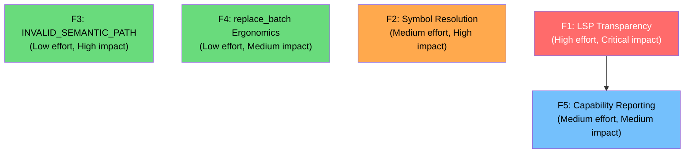

# Pathfinder v5.1 Requirements — Operational Reliability & Agent Experience Polish

**Version:** 5.1  
**Status:** Draft  
**Date:** 2026-04-02  
**Origin:** Consolidated feedback from multi-session agent usage reports, reproduced issues, and codebase audit findings  

---

## 1. Executive Summary

This document defines targeted improvements to address **real agent friction points** discovered during extensive Pathfinder v5 usage. Unlike v5 (which focused on new capabilities), v5.1 focuses on **operational reliability**, **error clarity**, and **diagnostic transparency** — areas where agents lose time or make wrong choices due to ambiguous signals from the server.

### Impact Assessment — Feedback-to-Issue Mapping

| Feedback Issue | Status | Relevance | Epic |
|---|---|---|---|
| LSP validation always skipped (`lsp_error` / `no_lsp`) | **STILL PRESENT** | High — zero validation benefit on edits | F1 |
| `SYMBOL_NOT_FOUND` on valid dot-notation paths | **STILL PRESENT** | High — blocks reads, forces fallback | F2 |
| Malformed semantic paths produce confusing `FILE_NOT_FOUND` | **STILL PRESENT** | Medium — confuses agents, wastes retries | F3 |
| `replace_batch` `edit_type` field not intuitive | **PARTIALLY FIXED** | Medium — hybrid schema (E3.1) improved docs but field name unchanged | F4 |
| No upfront LSP degradation visibility | **STILL PRESENT** | Medium — agents discover validation is useless only at edit time | F5 |
| `read_source_file` naming confusion | **FIXED in v5** | Low — tool description now explicitly lists supported languages and redirects to `read_file` | — |
| `get_repo_map` depth default too shallow | **FIXED in v5** | Low — default changed from 3 to 5 | — |

### Design Principles for v5.1

1. **Fix the signals, not the features.** The features work — the problem is that agents can't tell when they're degraded.
2. **Dedicated error codes for distinct failure modes.** Every failure mode that requires a different recovery action must have its own error code.
3. **Proactive degradation signals.** Agents should know about operational limitations *before* they attempt an operation, not after.

---

## 2. Epics Overview

| Epic | Title | Priority | Estimated Complexity |
|---|---|---|---|
| F1 | LSP Validation Reliability & Transparency | Critical | High |
| F2 | Symbol Resolution Robustness | High | Medium |
| F3 | Dedicated `INVALID_SEMANTIC_PATH` Error Code | High | Low |
| F4 | `replace_batch` Schema Ergonomics | Medium | Low |
| F5 | Proactive Capability Reporting | Medium | Medium |

---

## 3. Epic F1 — LSP Validation Reliability & Transparency

### Problem Statement

Every edit during agent sessions returns `validation_skipped: true` with `validation_skipped_reason: "lsp_error"` or `"no_lsp"`. This means the Shadow Editor validation pipeline — Pathfinder's key differentiator — provides **zero value** in practice. Agents must always fall back to manual `cargo check` / `tsc` runs.

Two distinct problems are conflated:

1. **`no_lsp`** — No language server binary found for the file's language. This is an environment/configuration issue.
2. **`lsp_error`** — The LSP process exists but crashed, timed out during `did_open`, or returned a protocol error. This is a reliability issue in the LSP lifecycle management.

### Root Cause Analysis

From `crates/pathfinder/src/server/tools/edit.rs::run_lsp_validation`:

```rust
let (skipped_reason, should_log) = match &e {
    LspError::NoLspAvailable => ("no_lsp", false),
    LspError::UnsupportedCapability { .. } => ("unsupported", false),
    _ => ("lsp_error", true),  // ← catch-all bucket
};
```

The `lsp_error` catch-all hides critical distinctions:
- **LSP binary not on `$PATH`** → agent should install the language server
- **LSP crashed during startup** → retry with backoff may help
- **LSP crashed after `did_open`** → may be a project-specific issue (bad `tsconfig.json`)
- **LSP timed out** → machine is overloaded, agent should `cargo check` instead

### F1.1 — Granular LSP Skip Reasons

**Description:** Replace the catch-all `"lsp_error"` with specific, actionable skip reasons.

**New Skip Reason Taxonomy:**

| `validation_skipped_reason` | Cause | Agent Recovery Action |
|---|---|---|
| `no_lsp` | No language server detected for file type | Use external build check (`cargo check`, `tsc`) |
| `lsp_not_on_path` | Language server binary not found on `$PATH` | Install the language server |
| `lsp_start_failed` | LSP process failed to start (after retries) | Check server logs, verify project config |
| `lsp_crash` | LSP process crashed during validation | Restart may help; use external check as fallback |
| `lsp_timeout` | LSP didn't respond within timeout | Machine overloaded; use external check |
| `pull_diagnostics_unsupported` | LSP running but doesn't support Pull Diagnostics | Use external check (this LSP can't validate inline) |

**Acceptance Criteria:**
- Each `LspError` variant maps to a unique, descriptive skip reason
- The catch-all `"lsp_error"` is removed — no error goes into an opaque bucket
- All skip reasons are documented in the tool description
- The `should_log` flag remains: infrastructure errors log at `warn`, expected states (no LSP available) log at `debug` or not at all

### F1.2 — LSP Startup Diagnostics in Server Logs

**Description:** Emit structured log events during LSP lifecycle phases so operators can diagnose why validation is skipped.

**Required Log Events:**

| Phase | Log Level | Content |
|---|---|---|
| Language detection | `info` | Languages detected, LSP binaries found/missing |
| LSP spawn attempt | `info` | Binary path, workspace root, attempt number |
| LSP spawn failure | `warn` | Binary path, error, retry count, backoff duration |
| LSP initialized | `info` | Server name, capabilities (including `textDocument/diagnostic` support) |
| LSP marked unavailable | `warn` | Language, reason, permanent until restart |
| Validation skip | `debug` | File, skip reason, language |

**Acceptance Criteria:**
- An operator can determine why validation is skipped by reading the server logs
- No log event requires decompiling the code to understand
- Log level follows RFC 5424 semantics — `warn` for actionable issues, `info` for state transitions

### F1.3 — LSP Health Check Endpoint

**Description:** Expose LSP readiness state through `get_repo_map` (or a lightweight signal) so agents learn about validation availability *before* their first edit.

**Enhancement to `get_repo_map` response:**

```json
{
  "lsp_status": {
    "rust": { "status": "running", "capabilities": ["pull_diagnostics"] },
    "typescript": { "status": "unavailable", "reason": "binary_not_found" },
    "python": { "status": "crashed", "reason": "startup_failure" }
  }
}
```

**Acceptance Criteria:**
- `lsp_status` is included in `get_repo_map` responses (not a separate tool — avoid proliferating tools)
- Status is per-language, not per-file
- Possible statuses: `running`, `unavailable`, `crashed`, `starting`
- Agents can make informed decisions about whether to rely on Pathfinder validation or run external checks

---

## 4. Epic F2 — Symbol Resolution Robustness

### Problem Statement

`read_symbol_scope` and `replace_*` tools intermittently return `SYMBOL_NOT_FOUND` on valid semantic paths with dot-notation chains. This was reproduced during this analysis session:

```
read_symbol_scope("crates/pathfinder-common/src/types.rs::SemanticPath.parse")
→ SYMBOL_NOT_FOUND
```

The path is valid — `SemanticPath` is an `impl` block in the file with a `parse` method. The failure suggests that the Surgeon's symbol resolution doesn't always correctly walk `impl` blocks to find methods on types.

### Root Cause Hypothesis

The tree-sitter symbol extraction pipeline (`extract_symbols_from_tree`) produces symbol trees where:
- `impl Foo { fn bar() {} }` creates a symbol `Foo` (from impl) with child `bar`
- The semantic path `Foo.bar` expects this parent-child relationship to be walkable
- When multiple `impl` blocks exist for the same type, the resolution may fail to search all blocks

The `SemanticPath::parse` function correctly produces `SymbolChain([Symbol("SemanticPath"), Symbol("parse")])`, but the Surgeon's tree walk fails to locate it in the AST.

### F2.1 — Audit and Fix `impl` Block Symbol Resolution

**Description:** Ensure that dot-notation semantic paths correctly resolve to methods within `impl` blocks, even when:
- Multiple `impl` blocks exist for the same type in the same file
- The method has `#[must_use]`, `pub`, or other attributes
- The `impl` block has trait bounds (`impl<T: Display> Foo<T>`)

**Acceptance Criteria:**
- `read_symbol_scope("file.rs::Type.method")` resolves correctly for all `impl` blocks
- `replace_body("file.rs::Type.method", ...)` targets the correct method
- Add regression tests for:
  - Single `impl` block with methods
  - Multiple `impl` blocks for the same type
  - Generic `impl` blocks (`impl<T> Foo<T>`)
  - `impl Trait for Type` blocks (trait implementations)

### F2.2 — Improved Fuzzy Matching for Symbol Not Found

**Description:** When `SYMBOL_NOT_FOUND` occurs, improve the `did_you_mean` suggestions to include symbols from all `impl` blocks of the target type.

**Current behavior:** `did_you_mean` only suggests top-level symbols, not methods within `impl` blocks.

**Desired behavior:** If the agent asks for `Foo.bar` and `bar` exists in a different `impl` block than expected, suggest `Foo.bar` from the correct block with its qualified path.

**Acceptance Criteria:**
- `did_you_mean` searches all symbols in the file, not just the top-level AST
- Fuzzy matching uses `strsim` Levenshtein distance (already available)
- Suggestions include the full semantic path, not just the symbol name

---

## 5. Epic F3 — Dedicated `INVALID_SEMANTIC_PATH` Error Code

### Problem Statement

When an agent passes a bare symbol name without a file path (e.g., `send` instead of `crates/.../process.rs::send`), the `SemanticPath::parse` function treats the entire input as a bare file path. The subsequent file lookup then returns `FILE_NOT_FOUND: send` — which looks like a missing file, not a malformed path.

An agent that doesn't carefully read error codes will:
1. Assume the file `send` doesn't exist
2. Try alternative file paths
3. Waste 2-3 tool calls before realizing the path format was wrong

### Current Behavior (from `edit.rs`)

```rust
let Some(semantic_path) = SemanticPath::parse(&params.semantic_path) else {
    return Err(io_error_data("invalid semantic path"));
};
```

`SemanticPath::parse` returns `Some(...)` for `"send"` — it's treated as a bare file path `send` (no `::`). The error only surfaces later when the Surgeon tries to read the file `send`, which doesn't exist → `FILE_NOT_FOUND`.

### F3.1 — Add `INVALID_SEMANTIC_PATH` Error Variant

**Description:** Add a new error variant to `PathfinderError` for malformed semantic paths.

**New Error Variant:**

```rust
/// Semantic path is malformed or missing required '::' separator.
#[error("invalid semantic path: {input}")]
InvalidSemanticPath {
    input: String,
    issue: String,  // e.g., "missing '::' separator"
},
```

**Error Code:** `INVALID_SEMANTIC_PATH`

**Hint:**
```
"'{input}' is missing the file path — did you mean 'crates/.../file.rs::{input}'? 
 Semantic paths must include the file path and '::' separator (e.g., 'src/auth.ts::AuthService.login')."
```

**Acceptance Criteria:**
- New error variant added to `PathfinderError`
- Error code is `INVALID_SEMANTIC_PATH` (distinct from `FILE_NOT_FOUND`)
- Hint includes the raw input and a corrective example
- All tool call sites that currently use `io_error_data("invalid semantic path")` are updated to use the typed error

### F3.2 — Proactive Path Validation in Tools That Require `::` Separator

**Description:** For tools that *require* a symbol (not a bare file path) — `read_symbol_scope`, `replace_body`, `delete_symbol`, `get_definition`, `analyze_impact`, `read_with_deep_context` — validate early that the path contains `::` and reject bare file paths with the new `INVALID_SEMANTIC_PATH` error.

**Validation Logic:**

```rust
// For tools that REQUIRE a symbol target (not bare file paths):
let semantic_path = SemanticPath::parse(&params.semantic_path)
    .ok_or_else(|| /* INVALID_SEMANTIC_PATH */)?;

if semantic_path.is_bare_file() {
    return Err(PathfinderError::InvalidSemanticPath {
        input: params.semantic_path.clone(),
        issue: "this tool requires a symbol target — use 'file.rs::symbol' format".into(),
    });
}
```

**Tools affected:**
- `read_symbol_scope` — always requires a symbol
- `replace_body` — already rejects bare files with `InvalidTarget`, but should use `InvalidSemanticPath` when `::` is missing entirely
- `delete_symbol` — already has a bare-file check, same improvement
- `get_definition` — requires a symbol to jump to
- `analyze_impact` — requires a symbol for call graph analysis
- `read_with_deep_context` — requires a symbol to extract context from

**Tools NOT affected (bare file paths are valid):**
- `replace_full` — bare file paths mean "replace entire file" (valid)
- `insert_before` / `insert_after` — bare file paths mean "top/bottom of file" (valid)
- `replace_batch` — file path is separate from semantic paths in edits

**Acceptance Criteria:**
- All 6 affected tools reject bare file paths with `INVALID_SEMANTIC_PATH`
- The error hint tells the agent exactly what format is expected
- Bare file paths continue to work for tools where they are valid
- Add unit tests for each affected tool

---

## 6. Epic F4 — `replace_batch` Schema Ergonomics

### Problem Statement

When agents use `replace_batch` with semantic targeting (Option A), they frequently forget the `edit_type` field or use incorrect field names (e.g., `type` instead of `edit_type`). The deserialization error from `serde` is:

```
missing field `edit_type`
```

This is not immediately actionable — the agent doesn't know which field it missed or what the valid values are.

### Current State (v5)

The hybrid batch schema (E3.1) improved documentation significantly, and the `edit_type` field has `#[serde(default)]` so it won't cause a *deserialization* error anymore. However, an empty `edit_type` string still causes a runtime error:

```rust
match edit.edit_type.as_str() {
    "replace_body" => { ... },
    "replace_full" => { ... },
    _ => return Err(io_error_data(format!("unsupported edit type: {}", edit.edit_type)))
}
```

The error message `"unsupported edit type: "` (empty string) is not helpful.

### F4.1 — Better Error Message for Missing/Invalid `edit_type`

**Description:** When a semantic edit in `replace_batch` has an empty or invalid `edit_type`, return a clear, actionable error.

**Improved Error:**

```json
{
  "error": "INVALID_TARGET",
  "message": "edit_type is required for semantic targeting. Got: '' (empty).",
  "hint": "Set edit_type to one of: 'replace_body', 'replace_full', 'insert_before', 'insert_after', 'delete'. Or use text_target for text-based targeting.",
  "details": {
    "valid_edit_types": ["replace_body", "replace_full", "insert_before", "insert_after", "delete"],
    "edit_index": 0
  }
}
```

**Acceptance Criteria:**
- Empty `edit_type` in a semantic edit produces a clear error with valid options listed
- Invalid `edit_type` values produce the same error with valid options
- The error includes the `edit_index` so agents know which edit in the batch failed
- Add test for empty `edit_type` and invalid `edit_type` scenarios

---

## 7. Epic F5 — Proactive Capability Reporting

### Problem Statement

Agents discover operational limitations reactively — they attempt an edit, it succeeds, but validation was skipped. By the time they see `validation_skipped: true`, they've already committed the edit and must run an external verification step they didn't plan for.

### F5.1 — Capability Summary in `get_repo_map` Response

**Description:** Add an optional `capabilities` section to `get_repo_map` responses that summarizes what Pathfinder can and cannot do for this workspace.

**Response Enhancement:**

```json
{
  "capabilities": {
    "edit_validation": {
      "available": false,
      "reason": "No LSP servers detected. Edits will succeed but validation will be skipped. Run `cargo check` or equivalent after editing.",
      "per_language": {
        "rust": { "validation": false, "reason": "rust-analyzer not found on $PATH" },
        "typescript": { "validation": false, "reason": "typescript-language-server not found on $PATH" }
      }
    },
    "supported_languages": ["rust", "typescript", "python", "go", "vue", "tsx", "jsx"],
    "vue_multi_zone": true,
    "text_targeting": true
  }
}
```

**Acceptance Criteria:**
- `capabilities` is included in `get_repo_map` responses
- `edit_validation.available` is `true` only if at least one LSP server is running and responsive
- Per-language breakdown helps agents decide which files to validate externally
- The `reason` field is human-readable and actionable
- Does not add measurable latency to `get_repo_map` (reads cached LSP state, no new spawns)

---

## 8. Verification Plan

### Automated Tests

| Epic | Crate | Test Focus |
|---|---|---|
| F1 | `pathfinder` (server) | Granular skip reasons map to correct `LspError` variants |
| F2 | `pathfinder-treesitter` | Symbol resolution across multiple `impl` blocks |
| F3 | `pathfinder-common` | `INVALID_SEMANTIC_PATH` error variant, hints |
| F3 | `pathfinder` (server) | All 6 tools reject bare paths with correct error code |
| F4 | `pathfinder` (server) | Empty/invalid `edit_type` produces actionable error |
| F5 | `pathfinder` (server) | `get_repo_map` includes `capabilities` with LSP status |

### Commands

```bash
# Unit tests
cargo test --workspace

# Integration tests
cargo test --workspace -- --test-threads=1 --ignored

# Linting
cargo clippy --workspace --all-targets -- -D warnings

# Formatting
cargo fmt --all -- --check
```

### Manual Verification

After implementation, run an agent session that exercises:
1. Editing Rust code → check `validation_skipped_reason` is granular
2. Using `read_symbol_scope` on `impl` methods → verify resolution works
3. Passing bare symbol names → verify `INVALID_SEMANTIC_PATH` error
4. Calling `get_repo_map` → verify `capabilities.edit_validation` is present
5. Calling `replace_batch` with empty `edit_type` → verify clear error

---

## 9. Implementation Priority and Dependencies



**Phase 1 (quick wins, parallel):** F3, F4 — both are low effort with immediate agent experience improvement  
**Phase 2 (medium effort):** F2 — symbol resolution fix unblocks reliable `impl` method operations  
**Phase 3 (high effort):** F1 → F5 — LSP reliability first, then expose status to agents

---

## 10. Non-Goals for v5.1

1. **New features** — v5.1 is purely about operational reliability and error clarity
2. **LSP auto-installation** — Pathfinder should not install language servers; it should clearly report what's missing
3. **Performance optimization** — not the focus unless reliability work reveals bottlenecks
4. **Additional language support** — deferred to v6
5. **Breaking schema changes** — all additions are backward-compatible

---

## 11. Relationship to v5 Requirements

v5.1 is a **companion document** to `pathfinder-v5-requirements.md`. It does not supersede or modify any v5 epics. Instead, it addresses operational gaps discovered during v5 implementation and agent testing.

| v5 Epic | v5.1 Relationship |
|---|---|
| E2 (Compact Read) | No change — working as designed |
| E3 (Hybrid Batch) | F4 improves error ergonomics for E3.1's semantic edits |
| E4 (Search Intelligence) | No change — working as designed |
| E7 (OCC Ergonomics) | F3 adds a missing error code that E7.3's hint system should have included |
| E1a (Multi-Zone SFC) | No change — F2 may improve resolution for zone-prefixed paths |

---

## 12. Appendix: Reproduced Issues During Analysis

### A. `SYMBOL_NOT_FOUND` Reproduction (April 2, 2026)

**Tool call:**
```json
{
  "semantic_path": "crates/pathfinder-common/src/types.rs::SemanticPath.parse"
}
```

**Expected:** Return the `parse` method source code from the `impl SemanticPath` block.

**Actual:** `SYMBOL_NOT_FOUND`

**Analysis:** The file contains an `impl SemanticPath` block at line 30 with a `parse` method at line 38. The path format is correct and documented. The symbol tree produced by `read_source_file` shows `SemanticPath` (Impl) at the expected location with correct line ranges. The resolution failure is intermittent — it may depend on AST cache state or the specific tree-sitter walk logic.

### B. `lsp_error` Catch-All (April 2, 2026)

```json
{
  "validation_skipped": true,
  "validation_skipped_reason": "lsp_error"
}
```

Returned on every edit operation during the session. From the code analysis, this catch-all maps to `_ => ("lsp_error", true)` in `run_lsp_validation`. The specific `LspError` variant that triggered it is not exposed to the agent — only logged server-side at `warn` level.
